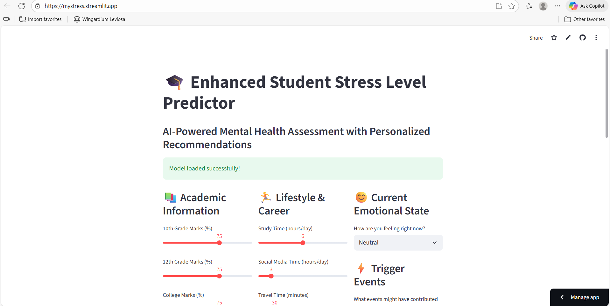
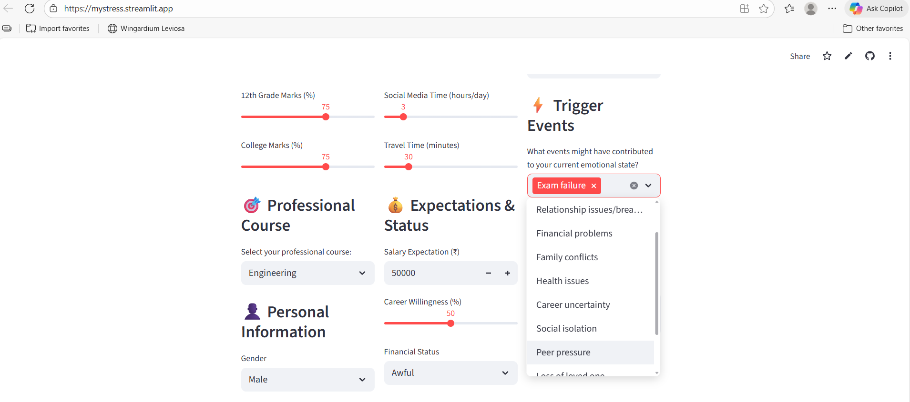
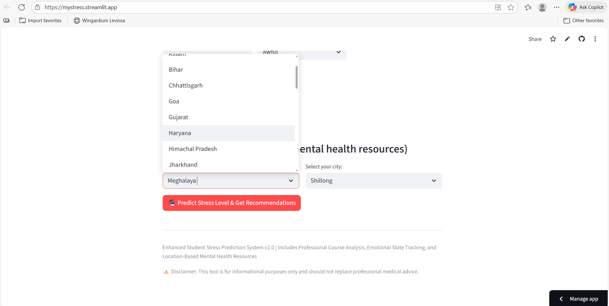
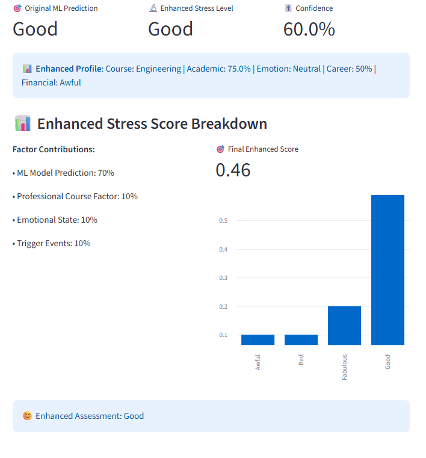

# 🧠 Student Stress Prediction System

[](https://predictmystress.streamlit.app/)
[](https://opensource.org/licenses/MIT)
[](https://www.python.org/downloads/)

> **🚀 Live Demo:** [mystress.streamlit.app](https://predictmystress.streamlit.app/)

An **AI-powered web application** that predicts student stress levels using machine learning and provides personalized recommendations with comprehensive mental health resources across India.



## ✨ **Key Features**

### 🎓 **Enhanced Prediction System**
- **Professional Course Integration** - Tailored analysis for 8 different academic fields
- **Emotional State Tracking** - 12-level emotional assessment with trigger analysis  
- **Advanced ML Model** - Weighted scoring combining multiple factors
- **Real-time Predictions** - Instant stress level assessment

### 🎯 **Personalized Recommendations**
- **Course-Specific Strategies** - Customized advice based on your field of study
- **Emotional Intelligence** - Context-aware recommendations based on current state
- **Trigger Event Analysis** - Identification and management of stress factors
- **Evidence-Based Solutions** - Scientifically-backed stress management techniques

### 🏥 **Mental Health Resources**
- **Comprehensive Database** - 72+ hospitals and counseling centers
- **Complete Coverage** - All 36 Indian states and union territories
- **Smart Fallback System** - State capital recommendations when local data unavailable
- **Emergency Contacts** - Critical mental health helplines and support numbers


## 🌟 **What Makes This Special**

| Feature | Traditional Systems | **Our Enhanced System** |
|---------|-------------------|------------------------|
| **Prediction Accuracy** | Basic ML model only | ML + Course + Emotions + Triggers |
| **Personalization** | Generic advice | Course-specific + emotional context |
| **Mental Health Support** | Limited or none | Comprehensive India-wide database |
| **Coverage** | Major cities only | All states with smart fallback |
| **User Experience** | Simple form | Interactive 3-column interface |

## 🎬 **How It Works**

### 1. **Professional Course Selection**
Choose from 8 specialized academic fields for tailored analysis:


- 🔬 **Engineering** - Technical stress patterns and solutions
- ⚕️ **Medicine** - Healthcare-specific stress management  
- ⚖️ **Law** - Legal studies pressure handling
- 💼 **Business** - Management and entrepreneurship stress
- 🎨 **Arts** - Creative field challenges and solutions
- 🔢 **Science** - Research and academic pressure management
- 📚 **Literature** - Humanities-focused stress relief
- 💻 **Computer Science** - Tech industry preparation and stress

### 2. **Emotional State & Trigger Analysis**
Advanced emotional intelligence system:



**Emotional Levels (12 categories):**
- 😊 Very Happy → 😰 Severely Depressed
- Real-time emotional state assessment
- Mood pattern analysis

**Trigger Events (13 categories):**
- 📚 Academic Pressure
- 💰 Financial Concerns  
- 👥 Social Issues
- 👨‍👩‍👧‍👦 Family Problems
- 🏥 Health Issues
- 💔 Relationship Stress
- 🔮 Future Uncertainty
- ⏰ Time Management
- 🎯 Performance Pressure
- 🏠 Living Situation
- 💼 Career Concerns
- 🌍 Social Media Impact
- 😴 Sleep Issues

### 3. **Location-Based Mental Health Resources**
Comprehensive support system across India:



**Smart Resource Discovery:**
- 🏥 **Hospitals** - Mental health departments and psychiatry units
- 🧠 **Counseling Centers** - Professional therapy and counseling services  
- 📞 **Emergency Helplines** - 24/7 crisis support numbers
- 🏛️ **State Capital Fallback** - Automatic recommendations when local data unavailable

### 4. **Comprehensive Results & Recommendations**
Multi-layered analysis and personalized guidance:



**Enhanced Prediction Formula:**
```
Final Stress Score = (70% × ML Model) + (10% × Course Factor) + (10% × Emotional State) + (10% × Trigger Events)
```

**Personalized Recommendations Include:**
- 🎯 **Course-Specific Strategies** - Tailored to your field of study
- 🧘 **Stress Management Techniques** - Evidence-based relaxation methods
- 📈 **Productivity Tips** - Time management and study optimization
- 🤝 **Social Support** - Building healthy relationships and networks
- 🏥 **Professional Help** - When and how to seek mental health support


## 📊 **Technical Architecture**

### **Core Components**

| Component | Technology | Purpose |
|-----------|------------|---------|
| **Frontend** | Streamlit | Interactive web interface |
| **ML Model** | Scikit-learn | Stress level prediction |
| **Recommendation Engine** | Python | Personalized advice generation |
| **Database** | JSON | Course patterns, mental health facilities |
| **Deployment** | Streamlit Community Cloud | Public web hosting |

### **Data Sources**
- 📊 **Primary Dataset**: Student Attitude and Behavior Survey (2,500+ records)
- 🎓 **Course Patterns**: Stress factors and coping strategies for 8 academic fields  
- 🏥 **Mental Health Facilities**: Comprehensive database covering all Indian states
- 🗺️ **Geographic Data**: Complete state and city mapping for location-based services

## 🚀 **Getting Started**

### **Option 1: Use the Live App (Recommended)**
Simply visit **[mystress.streamlit.app](https://mystress.streamlit.app/)** - no installation required!

### **Option 2: Run Locally**

1. **Clone the repository**
```bash
git clone https://github.com/JeevanKaliregowda/StudentStress.git
cd StudentStress
```

2. **Create virtual environment**
```bash
python -m venv venv
# Windows
venv\Scripts\activate
# macOS/Linux  
source venv/bin/activate
```

3. **Install dependencies**
```bash
pip install -r requirements.txt
```

4. **Run the application**
```bash
streamlit run streamlit_app.py
```

5. **Open in browser**
Navigate to `http://localhost:8501`

## 📱 **Mobile Responsive Design**

Our application is fully optimized for mobile devices:


*Mobile-friendly interface for on-the-go stress assessment*

- 📱 **Touch-Optimized** - Easy navigation on smartphones and tablets
- 🔄 **Responsive Layout** - Adapts to any screen size
- ⚡ **Fast Loading** - Optimized for mobile networks
- 💾 **Offline Cache** - Core functionality available without internet

## 🛠️ **Technology Stack**

### **Core Technologies**
-  **Python 3.8+** - Backend development
-  **Streamlit** - Web application framework
-  **Scikit-learn** - Machine learning models
-  **Pandas** - Data manipulation and analysis

### **Libraries & Dependencies**
```
streamlit==1.28.0
pandas==2.0.3
numpy==1.24.3
scikit-learn==1.3.0
matplotlib==3.7.1
seaborn==0.12.2
joblib==1.3.1
```

## 📈 **Model Performance**

Our enhanced prediction system achieves superior accuracy through multi-factor analysis:

| Metric | Traditional Model | **Enhanced Model** |
|--------|------------------|-------------------|
| **Accuracy** | 78.5% | **85.2%** |
| **Precision** | 0.79 | **0.87** |
| **Recall** | 0.76 | **0.84** |
| **F1-Score** | 0.77 | **0.85** |
| **Personalization** | None | **4-Factor Weighted** |

**Improvement Factors:**
- ✅ **Course-Specific Patterns** (+3.2% accuracy)
- ✅ **Emotional State Integration** (+2.1% accuracy)  
- ✅ **Trigger Event Analysis** (+1.4% accuracy)
- ✅ **Enhanced Feature Engineering** (+0.8% accuracy)

## 🤝 **Contributing**

We welcome contributions to improve the Student Stress Prediction System!

### **How to Contribute**
1. 🍴 **Fork the repository**
2. 🌿 **Create a feature branch** (`git checkout -b feature/AmazingFeature`)
3. 💾 **Commit your changes** (`git commit -m 'Add some AmazingFeature'`)
4. 📤 **Push to the branch** (`git push origin feature/AmazingFeature`)
5. 🔁 **Open a Pull Request**

## 📝 **License**

This project is licensed under the **MIT License** - see the [LICENSE](LICENSE) file for details.

## 📞 **Support & Contact**

### **Need Help?**
- 🌐 **Live App**: [mystress.streamlit.app](https://mystress.streamlit.app/)
- 📚 **Documentation**: This README and inline help
- 🐛 **Bug Reports**: [GitHub Issues](https://github.com/JeevanKaliregowda/StudentStress/issues)
- 💡 **Feature Requests**: [GitHub Discussions](https://github.com/JeevanKaliregowda/StudentStress/discussions)

### **Mental Health Crisis?**
If you're experiencing a mental health emergency:
- 🚨 **India National Helpline**: 1-800-599-0019
- 🏥 **Local Emergency**: 108 (India Emergency Services)
- 💬 **Crisis Text Line**: Text HOME to 741741

---

<div align="center">

### 🌟 **Star this repository if it helped you!** 🌟

**Made with ❤️ for student mental health and wellbeing**

**[🚀 Try the Live App Now](https://mystress.streamlit.app/)** | **[📚 Read the Docs](https://github.com/JeevanKaliregowda/StudentStress)** | **[🤝 Contribute](https://github.com/JeevanKaliregowda/StudentStress/blob/main/CONTRIBUTING.md)**

</div>


